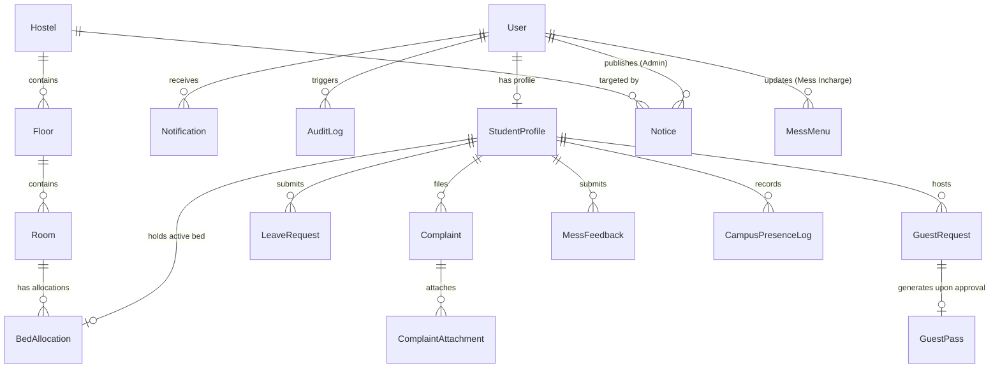

# HostelHub — Database Schema & Data Dictionary

## 1. Entity-Relationship Overview

---

## 2. Enumerated Types (Enums)

| Enum Name | Allowed Values | Description |
| :--- | :--- | :--- |
| `UserRole` | `STUDENT`, `WARDEN`, `MESS_INCHARGE` | System access role |
| `StudentType` | `HOSTELER`, `DAY_SCHOLAR` | Student residential classification |
| `GenderAllowed`| `MALE`, `FEMALE`, `COED` | Hostel block gender restriction |
| `RoomType` | `AC`, `NON_AC` | Room amenity classification |
| `ComplaintCategory` | `ELECTRICAL`, `PLUMBING`, `CARPENTRY`, `CLEANLINESS`, `INTERNET`, `MESS`, `OTHER` | Complaint domain |
| `ComplaintStatus` | `SUBMITTED`, `IN_PROGRESS`, `RESOLVED`, `REJECTED` | Complaint resolution lifecycle |
| `ComplaintPriority` | `LOW`, `MEDIUM`, `HIGH`, `URGENT` | Triage severity |
| `LeaveStatus` | `PENDING`, `APPROVED`, `REJECTED`, `CANCELLED` | Leave workflow state |
| `GuestStatus` | `PENDING`, `APPROVED`, `REJECTED` | Guest visit approval state |
| `MealType` | `NONE`, `BREAKFAST`, `LUNCH`, `DINNER`, `SNACKS` | Meal classification |
| `NoticeCategory` | `GENERAL`, `HOSTEL`, `MESS`, `URGENT`, `EVENT` | Bulletin board categorisation |
| `AudienceType` | `ALL`, `HOSTELERS`, `DAY_SCHOLARS` | Target notification group |
| `DayOfWeek` | `MONDAY`, `TUESDAY`, `WEDNESDAY`, `THURSDAY`, `FRIDAY`, `SATURDAY`, `SUNDAY` | Recurring mess menu scheduling |
| `NotificationType` | `SYSTEM`, `LEAVE`, `GUEST`, `COMPLAINT`, `NOTICE`, `MESS` | Push / in-app notification types |

---

## 3. Detailed Table Specifications

### 3.1. `User`
Stores credentials, role, and authentication status.
* `id`: `UUID` (Primary Key, default `uuid()`)
* `email`: `VARCHAR(255)` (Unique, Indexed)
* `passwordHash`: `VARCHAR(255)` (bcrypt hash)
* `role`: `UserRole` (Default: `STUDENT`)
* `isActive`: `BOOLEAN` (Default: `true`)
* `refreshToken`: `TEXT` (Nullable, hashed)
* `createdAt`: `TIMESTAMP` (Default: `now()`)
* `updatedAt`: `TIMESTAMP` (Auto-update)

### 3.2. `StudentProfile`
Extended attributes for users with role `STUDENT`.
* `id`: `UUID` (Primary Key, default `uuid()`)
* `userId`: `UUID` (Unique, Foreign Key -> `User.id`, onDelete: Cascade)
* `rollNumber`: `VARCHAR(50)` (Unique, Indexed)
* `firstName`: `VARCHAR(100)`
* `lastName`: `VARCHAR(100)`
* `phone`: `VARCHAR(20)`
* `studentType`: `StudentType` (Default: `HOSTELER`)
* `department`: `VARCHAR(100)`
* `yearOfStudy`: `INT`
* `guardianName`: `VARCHAR(100)`
* `guardianPhone`: `VARCHAR(20)`
* `guardianEmail`: `VARCHAR(255)` (Nullable)
* `isAllocated`: `BOOLEAN` (Default: `false`)
* `createdAt`: `TIMESTAMP` (Default: `now()`)
* `updatedAt`: `TIMESTAMP`

### 3.3. `Hostel`
Physical hostel building/block.
* `id`: `UUID` (Primary Key)
* `name`: `VARCHAR(100)` (Unique, e.g., "Kaveri Hostel Block A")
* `code`: `VARCHAR(20)` (Unique, e.g., "KB-A")
* `genderAllowed`: `GenderAllowed`
* `totalFloors`: `INT`
* `description`: `TEXT` (Nullable)
* `isActive`: `BOOLEAN` (Default: `true`)
* `createdAt`: `TIMESTAMP`
* `updatedAt`: `TIMESTAMP`

### 3.4. `Floor`
Floors inside a hostel block.
* `id`: `UUID` (Primary Key)
* `hostelId`: `UUID` (Foreign Key -> `Hostel.id`, onDelete: Cascade)
* `floorNumber`: `INT` (e.g. 0 for Ground Floor, 1 for 1st Floor)
* `floorName`: `VARCHAR(50)` (e.g., "1st Floor - Wing B")

### 3.5. `Room`
Individual living rooms on a floor.
* `id`: `UUID` (Primary Key)
* `floorId`: `UUID` (Foreign Key -> `Floor.id`, onDelete: Cascade)
* `roomNumber`: `VARCHAR(20)` (e.g., "204")
* `capacity`: `INT` (e.g., 2, 3, or 4 beds)
* `occupancy`: `INT` (Default: 0, tracked dynamically)
* `roomType`: `RoomType` (Default: `NON_AC`)
* `isActive`: `BOOLEAN` (Default: `true`)
* *Unique constraint*: `(floorId, roomNumber)`

### 3.6. `BedAllocation`
Maps a hosteler to a room and specific bed.
* `id`: `UUID` (Primary Key)
* `studentProfileId`: `UUID` (Foreign Key -> `StudentProfile.id`, onDelete: Restrict)
* `roomId`: `UUID` (Foreign Key -> `Room.id`, onDelete: Restrict)
* `bedLabel`: `VARCHAR(10)` (e.g., "Bed A", "Bed B")
* `allocatedFrom`: `DATE` (Default: `now()`)
* `allocatedTo`: `DATE` (Nullable)
* `isActive`: `BOOLEAN` (Default: `true`, Indexed)
* `allocatedByAdminId`: `UUID` (Foreign Key -> `User.id`)
* `createdAt`: `TIMESTAMP`
* `updatedAt`: `TIMESTAMP`
* *Unique constraint*: A student can have only ONE active allocation (`studentProfileId` where `isActive = true`).

### 3.7. `Complaint`
Issue tracking submitted by students.
* `id`: `UUID` (Primary Key)
* `studentProfileId`: `UUID` (Foreign Key -> `StudentProfile.id`, onDelete: Cascade)
* `title`: `VARCHAR(150)`
* `description`: `TEXT`
* `category`: `ComplaintCategory`
* `status`: `ComplaintStatus` (Default: `SUBMITTED`, Indexed)
* `priority`: `ComplaintPriority` (Default: `MEDIUM`)
* `assignedTo`: `VARCHAR(100)` (Nullable)
* `resolutionNotes`: `TEXT` (Nullable)
* `resolvedAt`: `TIMESTAMP` (Nullable)
* `createdAt`: `TIMESTAMP` (Default: `now()`)
* `updatedAt`: `TIMESTAMP`

### 3.8. `ComplaintAttachment`
Supporting images for complaints.
* `id`: `UUID` (Primary Key)
* `complaintId`: `UUID` (Foreign Key -> `Complaint.id`, onDelete: Cascade)
* `fileUrl`: `TEXT`
* `fileType`: `VARCHAR(50)` (e.g., "image/jpeg", "image/png")
* `createdAt`: `TIMESTAMP`

### 3.9. `LeaveRequest`
Hostel leave applications.
* `id`: `UUID` (Primary Key)
* `studentProfileId`: `UUID` (Foreign Key -> `StudentProfile.id`, onDelete: Cascade)
* `startDate`: `TIMESTAMP` (Indexed)
* `endDate`: `TIMESTAMP` (Indexed)
* `reason`: `TEXT`
* `destination`: `VARCHAR(255)`
* `emergencyContact`: `VARCHAR(20)`
* `status`: `LeaveStatus` (Default: `PENDING`, Indexed)
* `reviewedByAdminId`: `UUID` (Nullable, Foreign Key -> `User.id`)
* `reviewedAt`: `TIMESTAMP` (Nullable)
* `remarks`: `TEXT` (Nullable)
* `createdAt`: `TIMESTAMP`
* `updatedAt`: `TIMESTAMP`

### 3.10. `GuestRequest`
Student requests for temporary visitors.
* `id`: `UUID` (Primary Key)
* `hostStudentProfileId`: `UUID` (Foreign Key -> `StudentProfile.id`, onDelete: Cascade)
* `guestName`: `VARCHAR(100)`
* `relationship`: `VARCHAR(50)` (e.g. "Father", "Mother", "Guardian")
* `visitDate`: `DATE` (Indexed)
* `requestedMeal`: `MealType` (Default: `NONE`)
* `numberOfGuests`: `INT` (Default: 1)
* `reason`: `TEXT`
* `status`: `GuestStatus` (Default: `PENDING`, Indexed)
* `passNumber`: `VARCHAR(30)` (Unique, Nullable)
* `reviewedByAdminId`: `UUID` (Nullable, Foreign Key -> `User.id`)
* `reviewedAt`: `TIMESTAMP` (Nullable)
* `remarks`: `TEXT` (Nullable)
* `createdAt`: `TIMESTAMP`
* `updatedAt`: `TIMESTAMP`

### 3.11. `GuestPass`
Generated temporary pass for security check-in.
* `id`: `UUID` (Primary Key)
* `guestRequestId`: `UUID` (Unique, Foreign Key -> `GuestRequest.id`, onDelete: Cascade)
* `passCode`: `VARCHAR(30)` (Unique, Indexed)
* `validOn`: `DATE`
* `isVerifiedAtGate`: `BOOLEAN` (Default: `false`)
* `verifiedAt`: `TIMESTAMP` (Nullable)
* `createdAt`: `TIMESTAMP`

### 3.12. `Notice`
Campus and hostel bulletin announcements.
* `id`: `UUID` (Primary Key)
* `title`: `VARCHAR(200)`
* `content`: `TEXT`
* `category`: `NoticeCategory`
* `targetAudience`: `AudienceType` (Default: `ALL`)
* `targetHostelId`: `UUID` (Nullable, Foreign Key -> `Hostel.id`)
* `isPinned`: `BOOLEAN` (Default: `false`)
* `publishedByAdminId`: `UUID` (Foreign Key -> `User.id`)
* `createdAt`: `TIMESTAMP`
* `updatedAt`: `TIMESTAMP`

### 3.13. `MessMenu`
Weekly/daily meal scheduling.
* `id`: `UUID` (Primary Key)
* `dayOfWeek`: `DayOfWeek`
* `mealType`: `MealType`
* `items`: `TEXT` (Comma-separated list or JSON array string)
* `specialNotes`: `TEXT` (Nullable)
* `updatedByUserId`: `UUID` (Foreign Key -> `User.id`)
* `updatedAt`: `TIMESTAMP`
* *Unique constraint*: `(dayOfWeek, mealType)`

### 3.14. `MessFeedback`
Student meal ratings and review.
* `id`: `UUID` (Primary Key)
* `studentProfileId`: `UUID` (Foreign Key -> `StudentProfile.id`, onDelete: Cascade)
* `mealDate`: `DATE`
* `mealType`: `MealType`
* `rating`: `INT` (1 to 5)
* `foodQualityRating`: `INT` (1 to 5)
* `cleanlinessRating`: `INT` (1 to 5)
* `comment`: `TEXT` (Nullable)
* `createdAt`: `TIMESTAMP` (Default: `now()`)

### 3.15. `CampusGeofence`
Configured campus boundary parameters.
* `id`: `UUID` (Primary Key)
* `name`: `VARCHAR(100)` (e.g. "Main University Campus")
* `latitude`: `DECIMAL(10, 8)`
* `longitude`: `DECIMAL(11, 8)`
* `radiusMeters`: `FLOAT` (e.g. 500.0)
* `isActive`: `BOOLEAN` (Default: `true`)
* `createdAt`: `TIMESTAMP`

### 3.16. `CampusPresenceLog`
Recorded student location verifications.
* `id`: `UUID` (Primary Key)
* `studentProfileId`: `UUID` (Foreign Key -> `StudentProfile.id`, onDelete: Cascade)
* `latitude`: `DECIMAL(10, 8)`
* `longitude`: `DECIMAL(11, 8)`
* `accuracyMeters`: `FLOAT` (Nullable)
* `calculatedDistance`: `FLOAT`
* `isInside`: `BOOLEAN` (Indexed)
* `recordedAt`: `TIMESTAMP` (Default: `now()`, Indexed)

### 3.17. `Notification` & `AuditLog`
* `Notification`: `(id, userId, title, message, type, isRead, data, createdAt)`
* `AuditLog`: `(id, userId, action, entityType, entityId, details, ipAddress, createdAt)`
